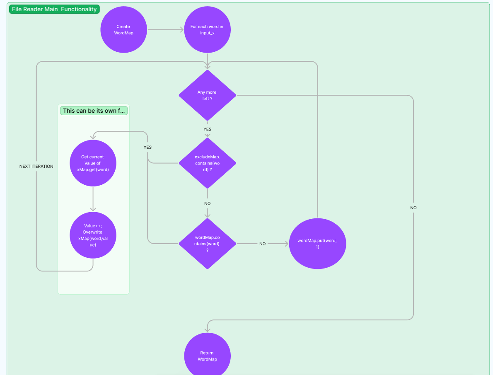
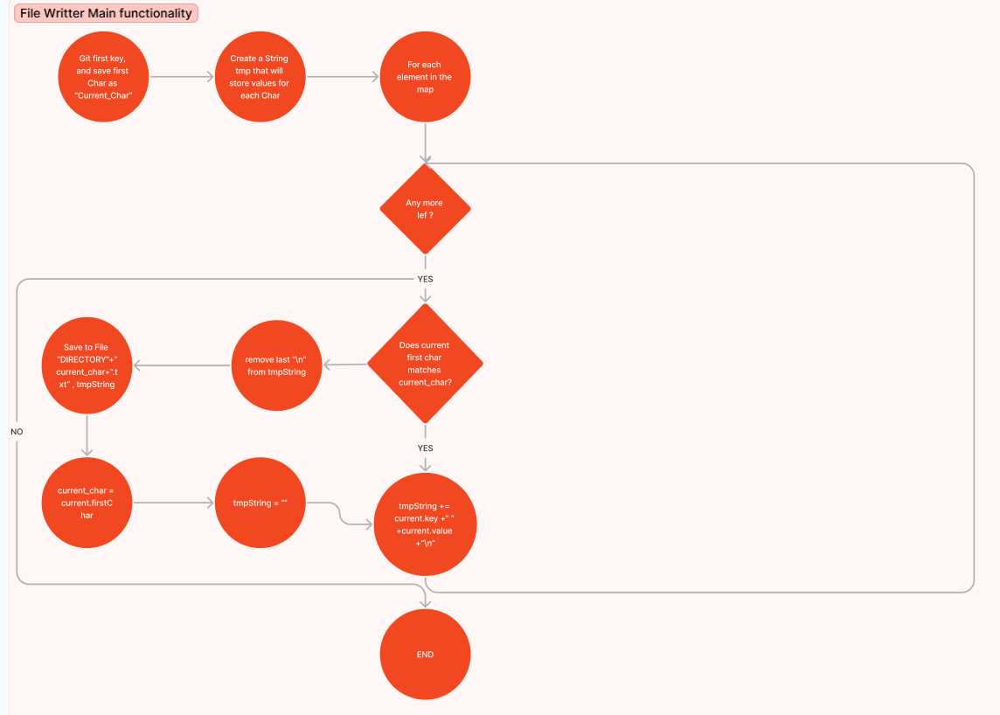

# WordCounter

I have taken the approach to start by analysing the problem and making respective diagrams of how I think it should be implemented. 

Of course, I lack access to the stake-holders of this challenge and this being a "quick delivery" project some points has been taken into consideration that were never confirmed by the challenge ( for example maximum number of lines per file)  that should allow the program to run smoothly and efficiently . If needed be this can be change in the future to enhance the program.

The functionality of the program is divided in two main areas, a file-reading and a file-writting. 

In each of them the logic of grouping the words happens. 

Below you can see the drawings of the analysis for this solution 
## Main Flow

## Fail Reader Functionality 

## File Writer Functionality 
