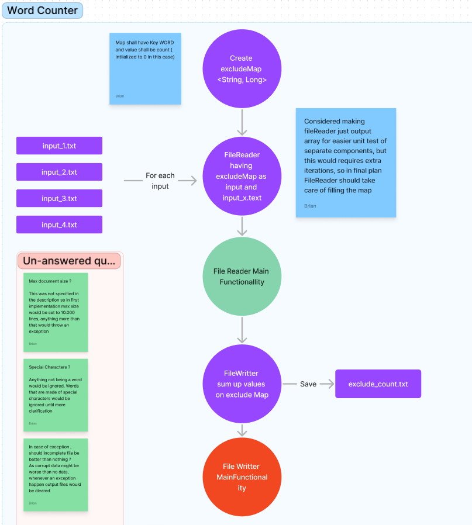

# WordCounter

I have taken the approach to start by analysing the problem and making respective diagrams of how I think it should be implemented. 

Of course, I lack access to the stake-holders of this challenge and this being a "quick delivery" project some points has been taken into consideration that were never confirmed by the challenge ( for example maximum number of lines per file)  that should allow the program to run smoothly and efficiently . If needed be this can be change in the future to enhance the program.

The functionality of the program is divided in two main areas, a file-reading and a file-writing. 

In each of them the logic of grouping the words happens. 

Below you can see the drawings of the analysis for this solution 
## Main Flow

## Fail Reader Functionality 

## File Writer Functionality 

----
### Decisions taken 
- For this to work, the files should be created beforehand, and they should have the correct name, same as correct location, this being :
`  xxx/input/exclude.txt` ` xxx/input/input_x.txt`
  ` xxx/output/exclude_ouput.txt` ` xxx/input/file_y.txt`
xxx being base path, x being a number, and y being an english character.

- If amount of words in exclude file is different from 10, program will throw an exception.
- When reaching a maximum amount of words program would stop , this is to avoid getting to places where the input is too large. This can be expanded to a certain amount without problem but to very large amounts might imply changes in the code.
- Any word not being starting with the 27 letters of english alphabet will be ignored
- When an exception occurs while writing to a file, program will try to clear the file
- Words consisting of special characters as "back-end" would be separated into their sub-parts ("back" and "end")
- Acronyms if written with special characters would be considered different words, if no special character then it would be considered one word,  for example : (C.I.A --> "C", "I", "A" ; FBI --> "FBI")
